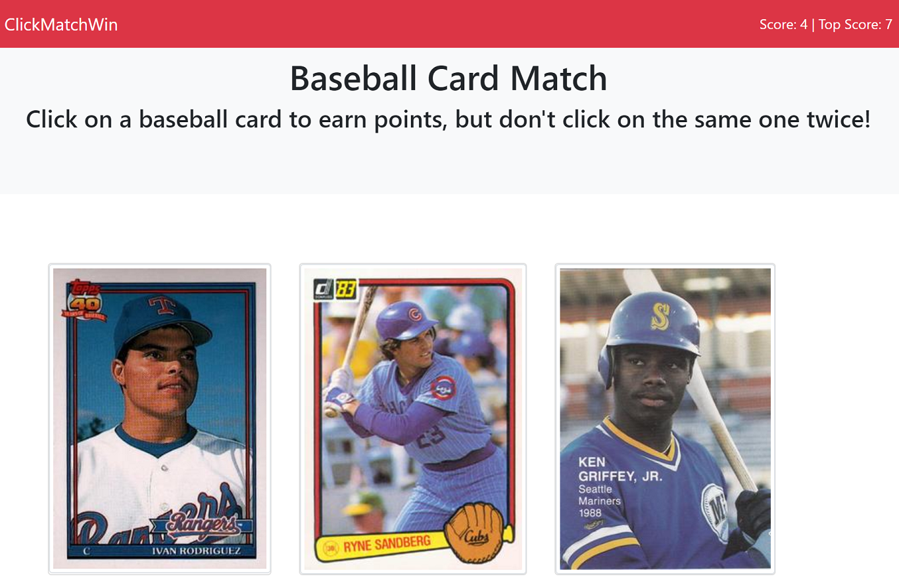
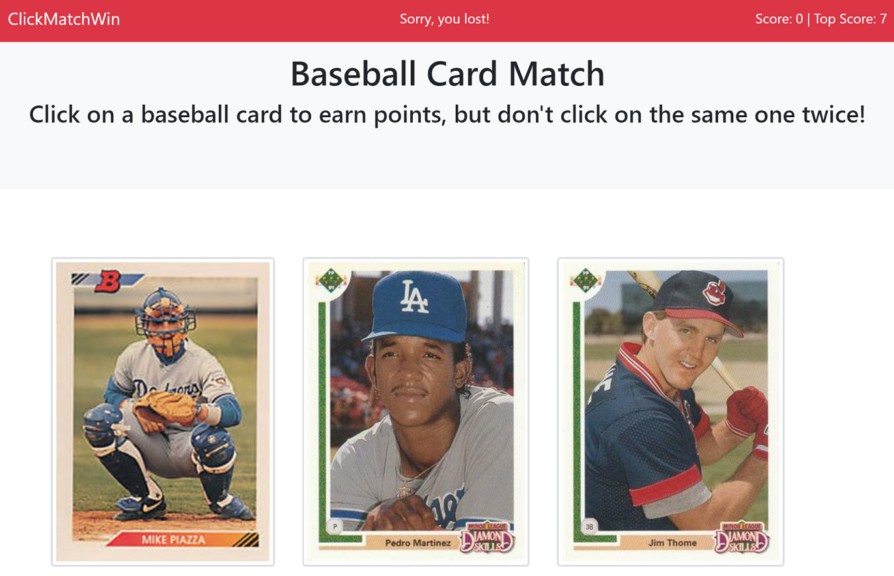
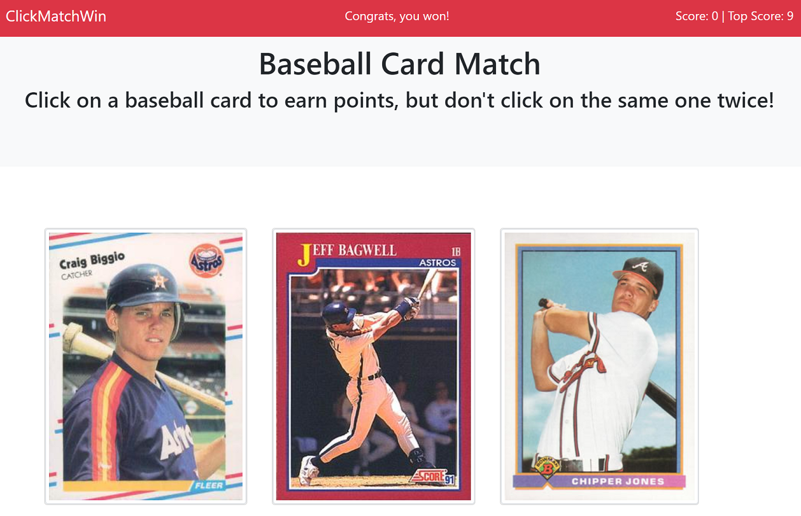

# ClickMatchWin: Baseball Card Memory Match Game

## About this Project
A fun app to test the user's memory. Click on each baseball card once, and only once, to accumulate points. Clicking twice on any card will reset the game.

Technologies used in this app include React and Bootstrap v4.1.

## Screenshots
Clicking on a card earns one point and shuffles the cards for the next guess

Sorry, you lost!

Great memory!

## Install and Run
Clone the repository to your local machine. Run `yarn install` to install the dependencies. Then run `yarn start` to start the server on `localhost:3000`.

## Deployed Site
[https://joseph526.github.io/friendly-rotary-phone/](https://joseph526.github.io/friendly-rotary-phone/)

## My Portfolio
[https://joseph526.github.io/](https://joseph526.github.io/)
